# Title
CrediKhaata – Loan Tracker for Shopkeepers

## Objective
To build a RESTful backend service ("CrediKhaata") using Node.js, Express, and MongoDB (or alternative) that allows shopkeepers to manage customers, record credit sales (loans), track repayments, and receive overdue payment alerts. The expected learning outcomes include: understanding RESTful API design, user authentication with JWT, database interactions, date manipulation, and basic project deployment principles.

## Demo

Link: https://credikhaata-loan-tracker-for-shopkeepers.onrender.com

## Tech Stack
Node.js, Express, MongoDB, Moment.js for due date logic, Mongoose, bcryptjs, jsonwebtoken, validator

## Setup Instructions
1) Create Project Directory: mkdir credikhaata
2) Navigate to that folder: cd credikhaata
3) Initialize Node.js Project: npm init -y
4) Install Dependencies: npm install express mongoose jsonwebtoken bcryptjs dotenv validator moment nodemon 
5) Set up .env File: Create a .env file to store sensitive information such as database connection strings, JWT secrets, and port number. Never commit this file to version control.
6) Create Initial Files: Create index.js, routes/, controllers/, and models/ directories. Also, create a .gitignore file and add node_modules/ and .env to it.

## Development Process
1) Database Setup: Set up a MongoDB database (or PostgreSQL/SQLite). Obtain the connection string and store it in your .env file.
2) Model Definition: Create Mongoose schemas (or equivalent) in the models/ directory for User, Customer, and Loan. Define the necessary fields and data types. Ensure appropriate relationships between the models.
3) User Authentication:
    * Registration Route: Implement a POST route for user registration (/register). Hash the password using bcryptjs before saving it to the database.
    * Login Route: Implement a POST route for user login (/login). Verify the user's credentials and generate a JWT token using jsonwebtoken upon successful authentication. Return the token to the client.
    * Middleware: Create middleware to verify the JWT token for protected routes. This middleware should extract the token from the request header, verify it, and attach the user information to the request object.
4) Customer Management:
    * CRUD Operations: Implement CRUD (Create, Read, Update, Delete) operations for customer profiles. These routes should be protected by the authentication middleware.
    * Validation: Implement validation to ensure that the customer data is valid (e.g., phone number format, trust score range).
    * User Scoping: Ensure that customers are scoped to the logged-in user. Only the user who created a customer should be able to access or modify that customer's information.
5) Loan Management:
    * Create Loan Route: Implement a POST route to create a new loan. Validate the input data and associate the loan with the correct customer.
    * View Loans Route: Implement a GET route to view all active loans for a specific user. Allow filtering by status (pending, paid, overdue).
    * Loan Status: Implement loan status logic based on due date and repayments.
    * User Scoping: As with customer management, ensure loans are scoped to the user who created them.
6) Repayment Tracking:
    * Record Repayment Route: Implement a POST route to record a repayment for a specific loan.
    * Update Loan Balance: Automatically update the loan balance based on the repayment amount.
    * Partial Payments: Handle partial payments correctly.
7) Loan Summary & Overdue Alerts:
    * /Summary Route: Implement a GET route (/summary) that calculates and returns the total loaned, total collected, overdue amount, and average repayment time for the logged-in shopkeeper.
    * /Overdue Route: Implement a GET route (/overdue) that returns a list of customers with overdue loans.
    * Auto-Tag Overdue Loans: Use moment.js or date-fns to compare the current date with the due date and automatically tag loans as overdue. This logic can be included in the /summary and /overdue routes.

## push the code to Git using the following commands
* git init
* git remote add origin https://github.com/Haripriya866/Credikhaata-Loan-Tracker-for-Shopkeepers.git
* git add -A
* git commit -m "CrediKhaata – Loan Tracker for Shopkeepers"
* git branch -M main
* git push -u origin main
  
## Deployment
Choose a Platform: Select a deployment platform like render

Configure Environment Variables: Set the necessary environment variables (database connection string, JWT secret, port number) on the deployment platform.

Deploy the Application: Follow the platform's instructions for deploying a Node.js application. This typically involves pushing your code to a Git repository and configuring the platform to run your application.

Test the Deployment: After deployment, test the application thoroughly to ensure that all features are working correctly.

Test the APIs using postman tool

## API Screenshots

#### REGISTER API

### Email and password are required
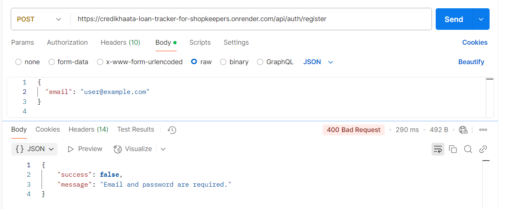

### User registered successfully
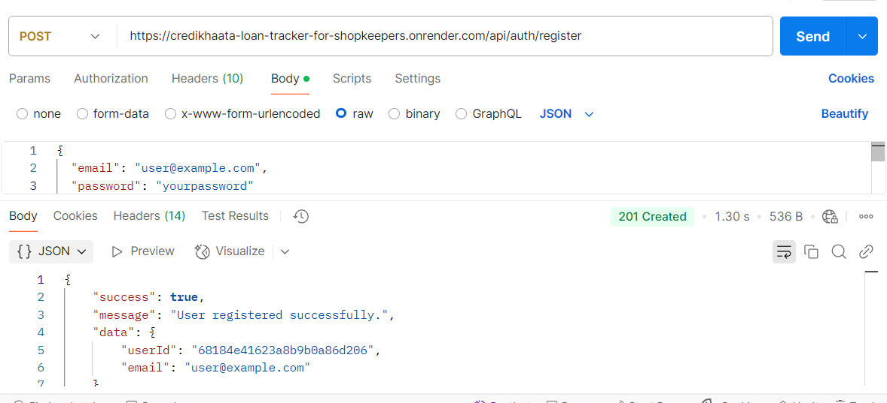

 ### User already exists with this email
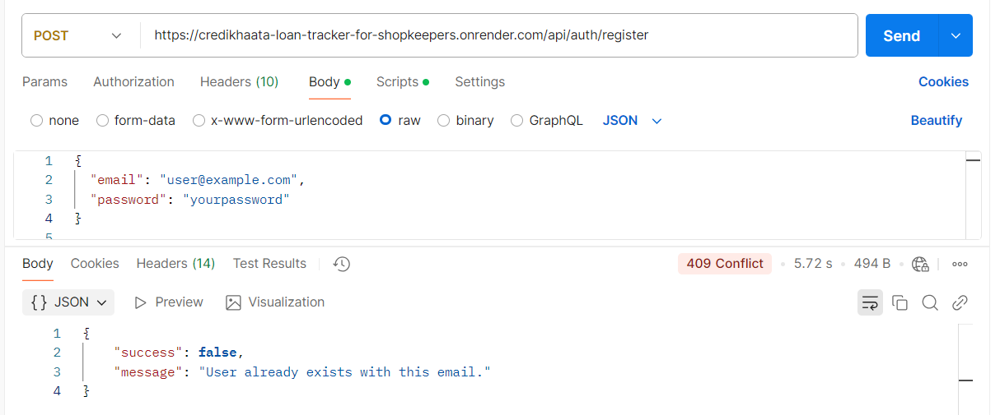

### Output
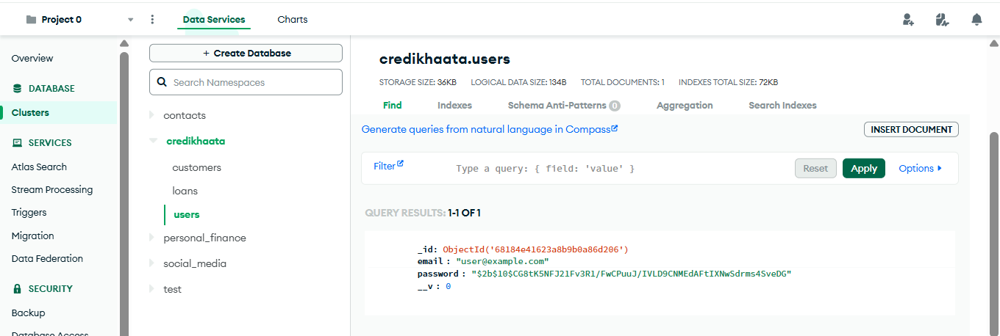

#### LOGIN API

### Email and password are required
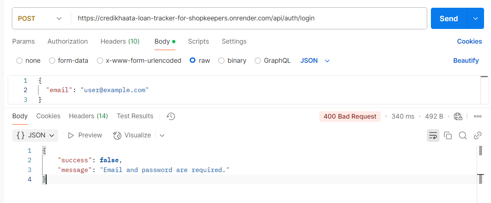

### User Login successfully
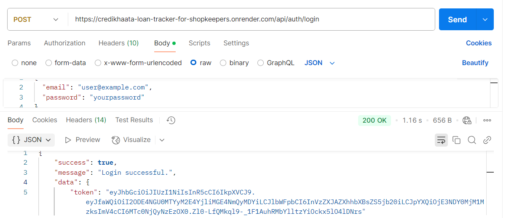

### Invalid email or password
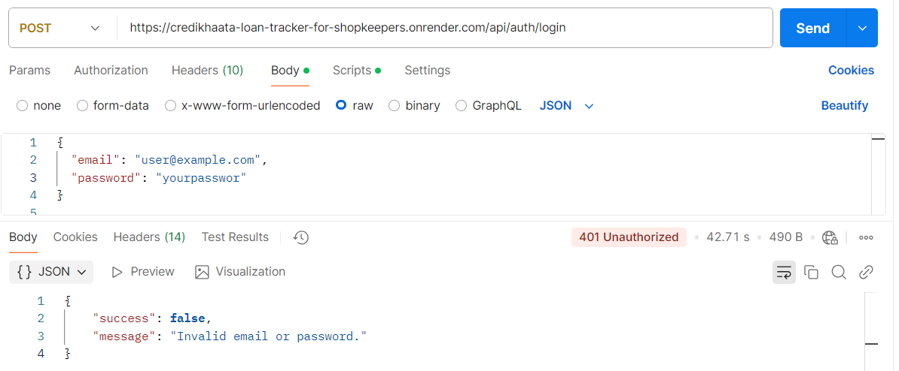

##### CRUD Operations on Customer API

#### createCustomer API

### name and phone are required
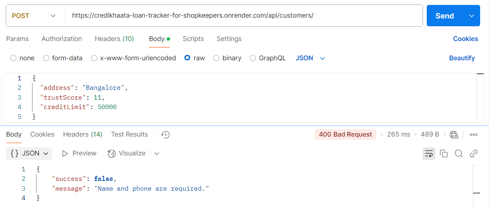

### Invalid phone number
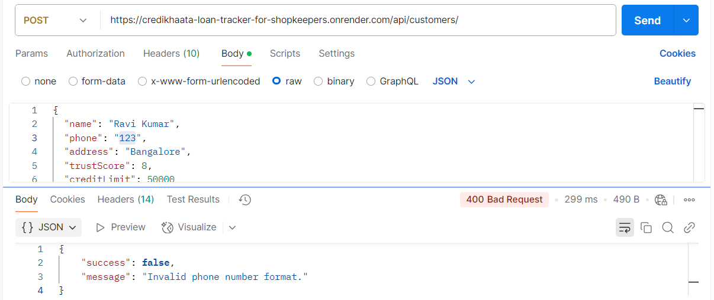

### Trust score must be between 0 and 10  
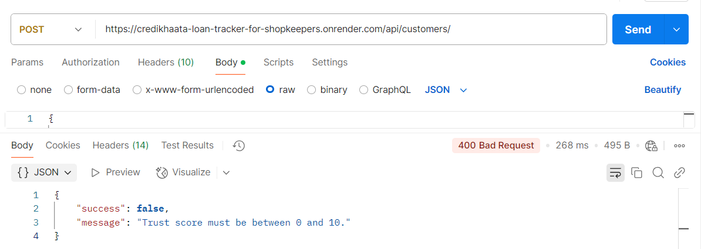

### Customer created successfully  
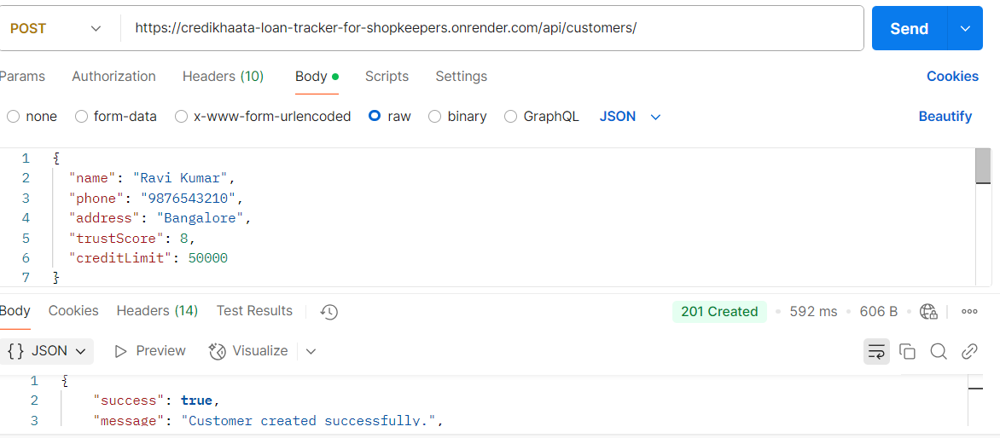

#### getCustomers API

### Customer retrieved successfully  

#### updateCustomer API

### Customer not found  
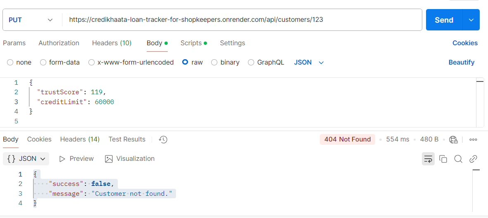

### Invalid phone number format  
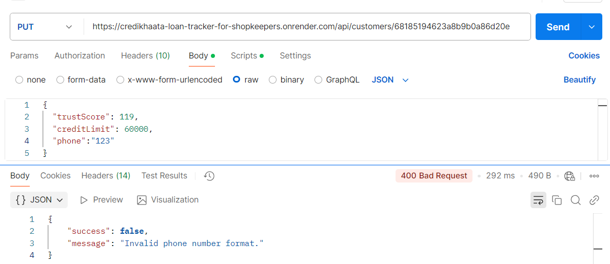

### Trust score must be between 0 and 10  
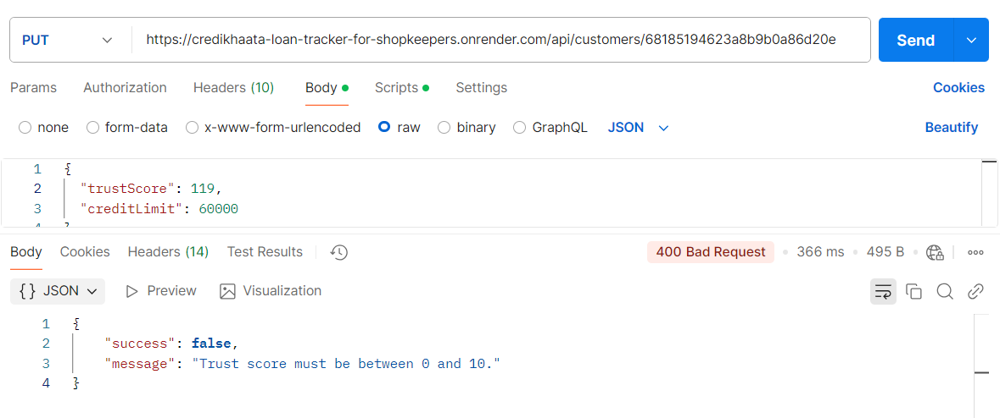

### Customer updated successfully  
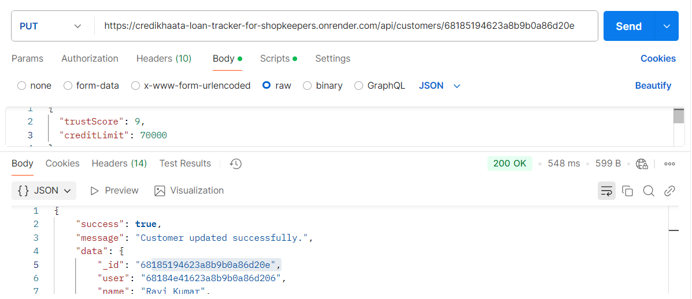

#### deleteCustomer API

### Customer deleted successfully  
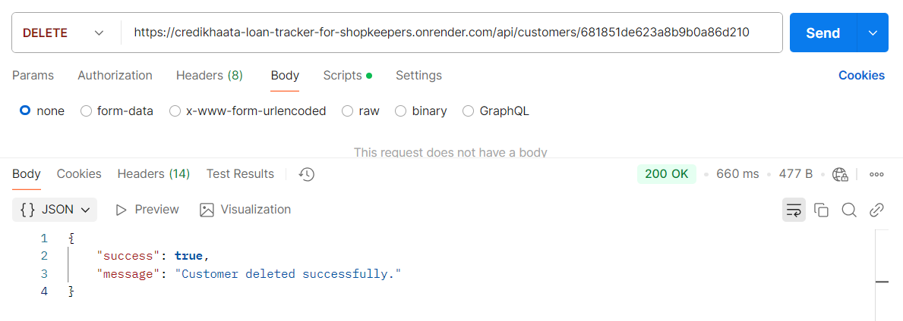

#### Loan API

### Loan created successfully  
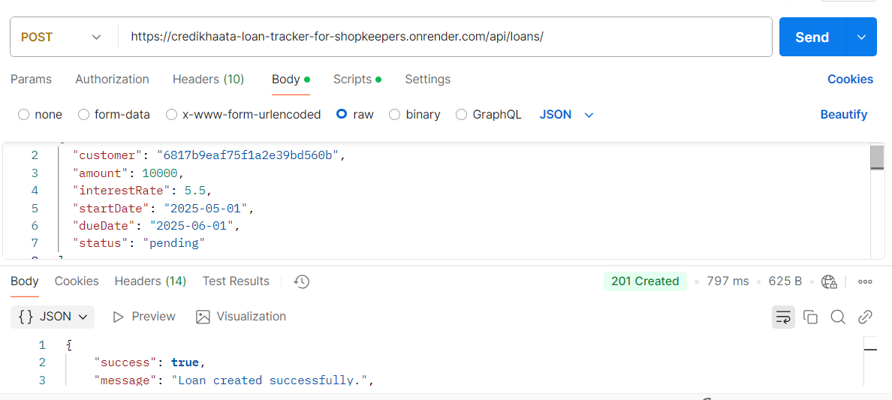

### Loans fetched successfully  
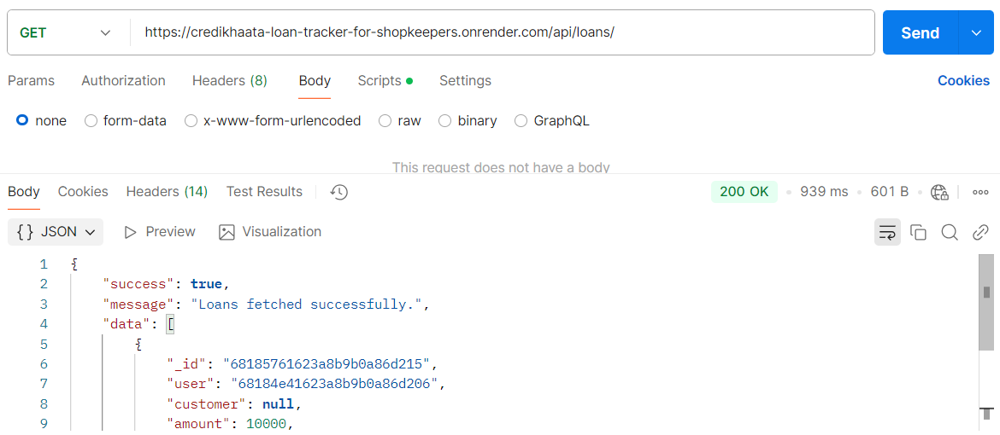

#### Repayment API

### Invalid loanId format  
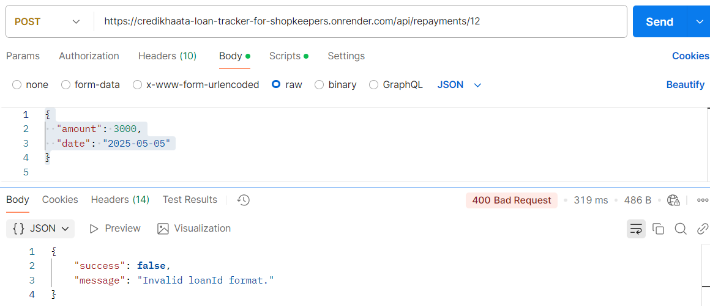

### Repayment recorded successfully  
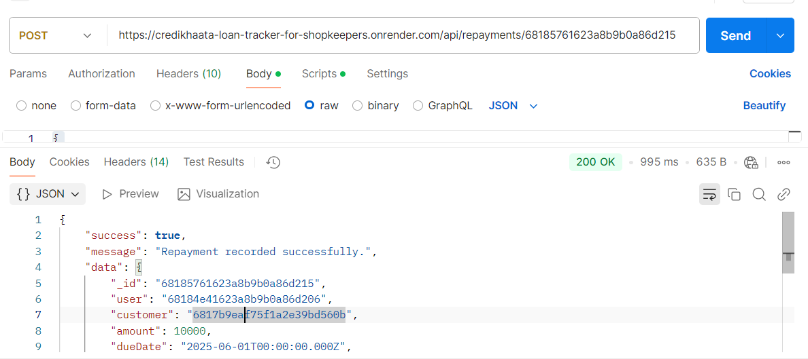

#### Loan Summary & Overdue Alerts API

### Loan summary fetched successfully  
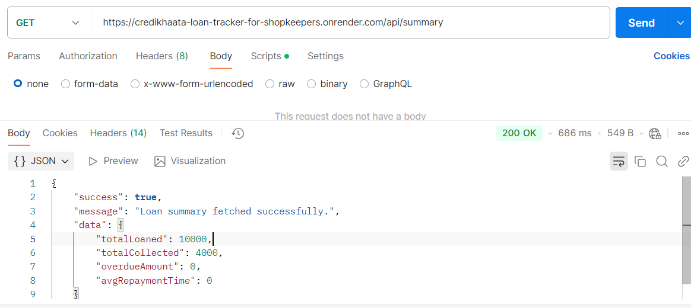

### Overdue loans fetched successfully  
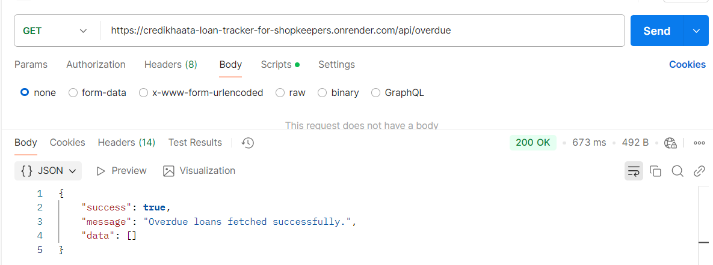